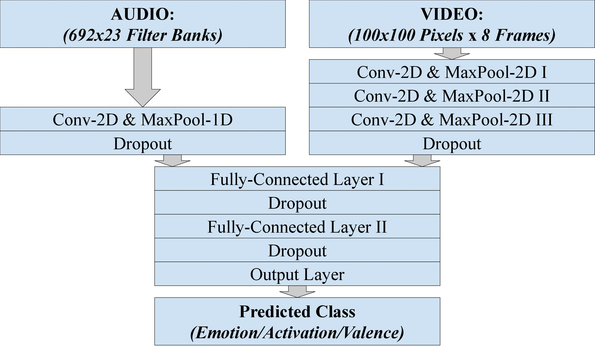

# emotion_recognition_audio-visual

## Summary
The goal of this project was to train and evaluate a model that would be able to automatically recognize one of **4 emotion classes** _(Angry, Happy, Neutral, Sad)_ from a speech signal and a video stream by combining the two modalities via model-level fusion.  
In addition to the **emotion class model**, auxiliary models for **activation** and **valence** were trained.

## Data
The data consisted of utterances from 12 speakers (6 female / 6 male) collected in 6 dyadic sessions. The vast majority of the data is assumed to be natural and not acted.

Emotion Class | Count | Percentage
------------ | ------------- | -------------
_Total_ | _7,756_ | _100.00%_
Angry | 791 | 10.20%
Happy | 2,622 | 33.81%
Neutral | 3,458 | 44.59%
Sad | 885 | 11.41%

## Feature Extraction/Multimodal Dataframe
* Using pandas dataframes containing acoustic/visual features and labels (Mel log filterbanks/grayscaled face detections as features) which were created in context of the unimodal emotion recognition models
* Creating a new uniform pandas dataframe by taking the intersection of both dataframes in order to ensure that data from both modalities is present for all samples
* Padding/cutting audio features to a universal shape (mean nr of frames + std)

## Preprocessing/Training/Evaluation
* Normalizing via Z-Score (mean=0; std=1)
* Using model designs resembeling the architectures of the individual unimodal models up to the fusion step. Performing model-level-fusion by capturing the outputs of the
2 individual CNNs and concatenating the learned features. Each modality contributed an approximately equal amount of features during the fusion, which was desired. Following the concatenation up with 2 fully connected layers
* Performing training/evaluation in a 6-fold cross validation approach

## Model Architecture
Simplified visualization of the model architecture.

  

## Evaluation Results
Averaged results of the 6 individual evaluations.

|Emotion Class|
|:-------------------------:|
||

Activation             |  Valence
:-------------------------:|:-------------------------:
  |  
